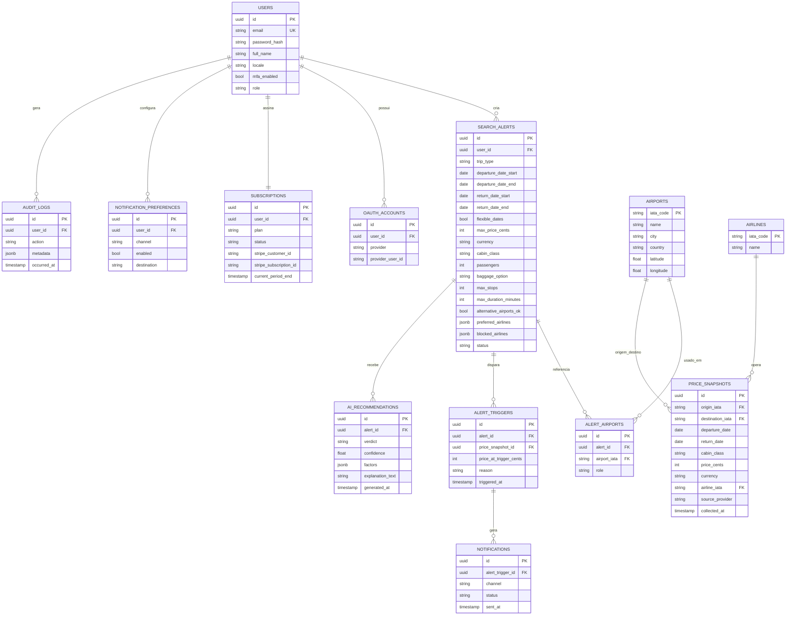

# 5. Modelo de Dados

Modelo relacional (PostgreSQL). Convenção: `id` como UUID, timestamps
`created_at`/`updated_at` em todas as tabelas (omitidos abaixo por brevidade).

## 5.1 Diagrama de entidades (visão MVP + Beta)

## 5.2 Notas de modelagem

- **`SEARCH_ALERTS` × `ALERT_AIRPORTS`**: um alerta pode ter múltiplos aeroportos de
  origem e/ou destino (campo `role` = `origin`/`destination`), atendendo ao requisito
  de múltiplos aeroportos desde o desenho do schema — mesmo que o MVP restrinja isso
  na camada de aplicação (1 origem, 1 destino) para reduzir escopo.
- **`PRICE_SNAPSHOTS`**: candidata natural a virar *hypertable* do TimescaleDB
  (particionada por `collected_at`) quando o volume crescer; índice composto em
  `(origin_iata, destination_iata, departure_date, cabin_class, collected_at)` para
  as consultas de histórico. Rollup diário/semanal após 90 dias para conter o
  crescimento (guarda `min/avg/max` agregados; MVP mantém granularidade fina só nos
  primeiros 30–90 dias, conforme plano do usuário).
- **`AI_RECOMMENDATIONS`**: `factors` guarda os dados que embasaram a explicação
  (ex.: `{"below_avg_pct": 18, "historical_min_hits_last_year": 4, "trend_7d": "down"}`)
  — é o que permite a IA "explicar o motivo", não só dar um veredito.
- **`ALERT_TRIGGERS`**: histórico imutável de disparos — base para calcular a métrica
  de "economia validada" do roadmap (`02-mvp-roadmap.md`, seção 3.7).
- Tabela de **`BOOKINGS`** (reserva/emissão) é adiada para a Fase 3 (V1), quando a
  decisão de fornecedor de emissão estiver definida — ver `01-analise-e-riscos.md`.
