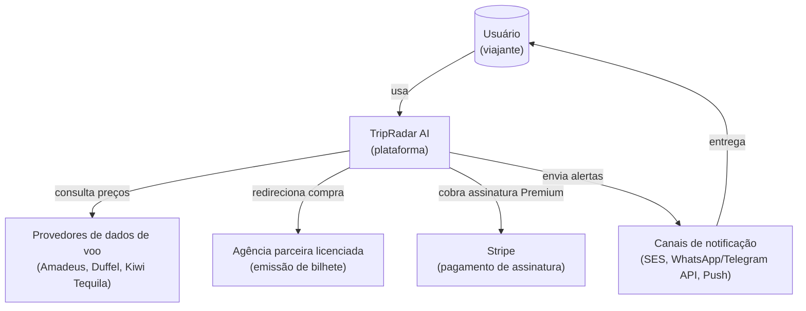
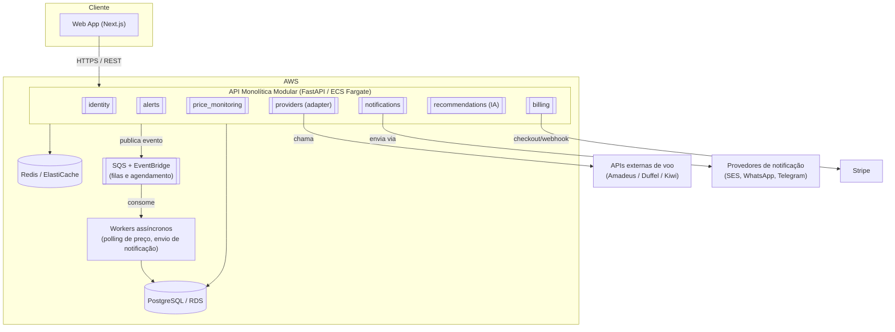
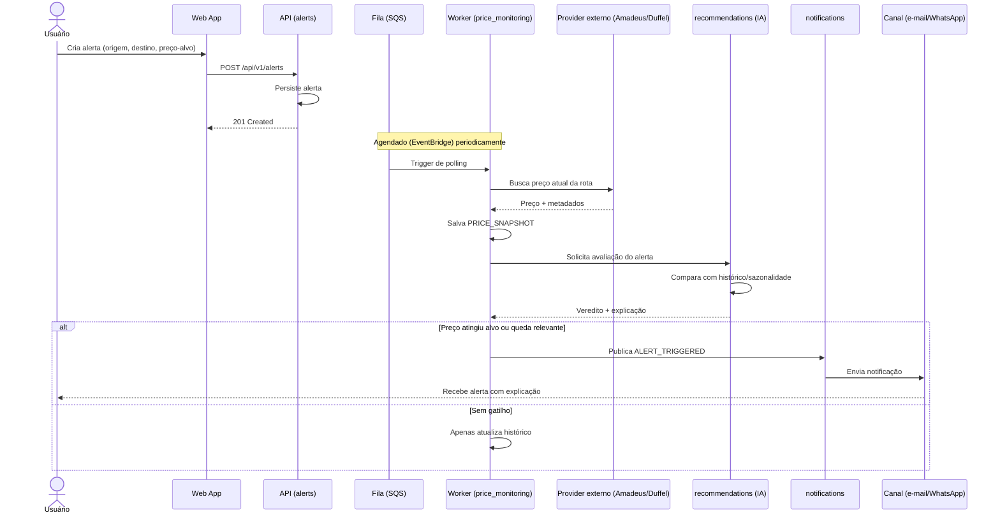
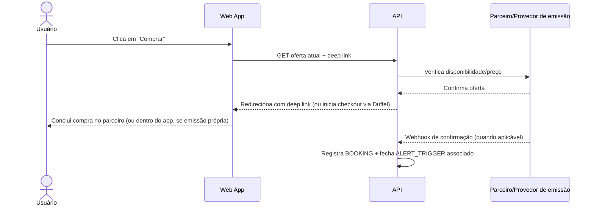

# 7. Diagramas de Arquitetura

## 7.1 Diagrama de contexto (C4 — nível 1)

## 7.2 Diagrama de contêineres (C4 — nível 2, monólito modular)

## 7.3 Sequência — criação de alerta até notificação

## 7.4 Sequência — fluxo de compra (V1, com parceiro)

